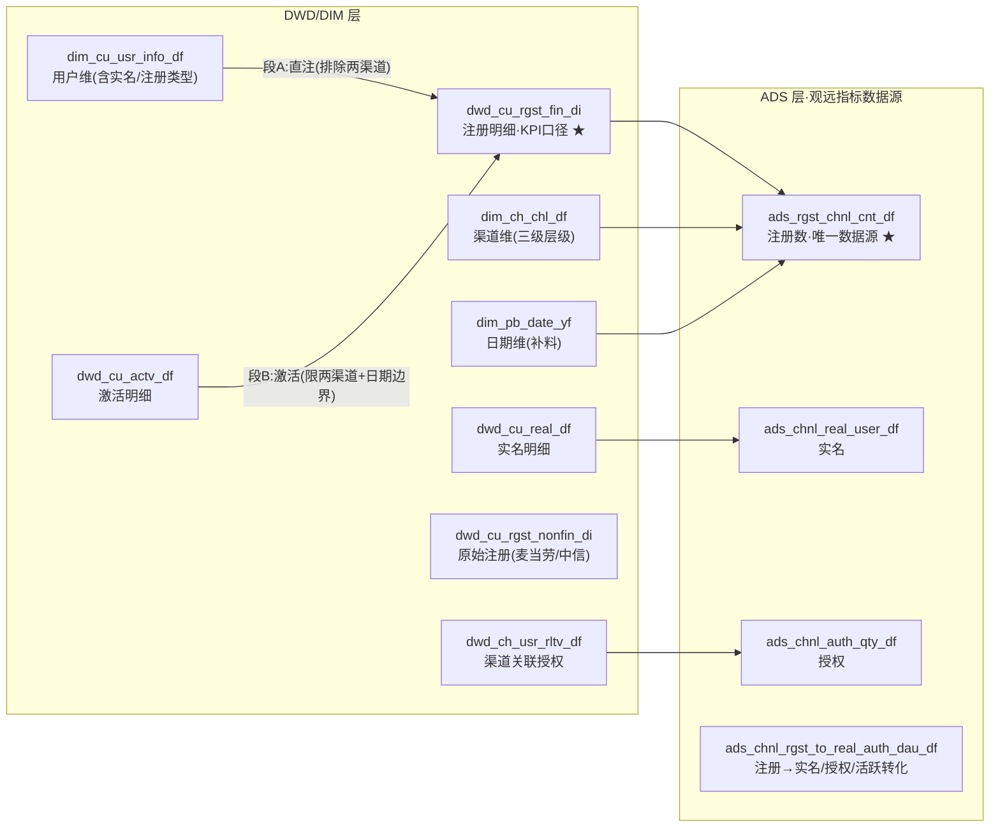

# 财富广场·口径发现卡片（2026-09-10，动员会素材）

> 这些业务规则全部从数仓 ETL 脚本（2026-09-10 交付的 15 个正式调度 SQL）里直接读出，**不是猜的**。它们之前只存在于 SQL 代码和各位的脑子里——任何数据字典、文档里都没有。语义层的第一使命，就是把这些口径显式化、可查询、可校验。
> 证据文件：`materials/fortune-warehouse-input/2026-09-10-数仓ddl及脚本/`

## 卡1 「注册 KPI 口径」的完整逻辑（比所有人以为的都复杂）

**一句话：麦当劳、中信书院的用户，光注册不算 KPI，"激活"了才算。**

`dwd_cu_rgst_fin_di`（注册 KPI 明细）每天增量 = 两段拼起来：

| 段 | 谁进 | 条件 |
|---|---|---|
| A：直接注册 | 用户维表当天新增 | 注册渠道 **不是** 麦当劳/中信书院 |
| B：激活转化 | 激活表当天激活 | 用户维表渠道 **是** 麦当劳/中信书院，且带 `if_act=1` 标记 |

激活本身还有三道写死的业务规则（全部硬编码在 SQL 里）：
- `actv_tag='1'`（关联渠道）：**2024-06-30 前的中信优享+公众号不算**，2024-07-01 起算；
- `actv_tag='2'`（企微+小程序关注）：**2024-07-09 上线起算**；
- 一人多条激活记录：按用户取**最早一条**（row_number 去重）。

## 卡2 一张报表指标表，同算 5 个时间口径

`ads_rgst_chnl_cnt_df`（**观远注册指标唯一数据源**）每行同时算出：

| 字段 | 口径 |
|---|---|
| New_Rgst_Cnt_D | 当日新增 |
| New_Rgst_Cnt_7D | 近 7 日新增 |
| New_Rgst_Cnt_M | 当月新增 |
| New_Rgst_Cnt_Y | 当年累计 |
| New_Rgst_Cnt_A | 历史累计 |

**方法论意义**：这正是"派生指标 = 原子指标 + 时间周期修饰词"的活实证——一个注册数，×5 个时间窗。语义层建成后，这 5 个口径是同一个原语的 5 个参数，不是 5 个指标。

## 卡3 渠道是三级层级，还带三个口径开关

渠道维 `dim_ch_chl_df` 自映射出**三级渠道**（一级/二级/三级），另带：
- `fin_chnl_flg` 金融渠道标识（金融/非金融口径的分界）
- `chnl_type` 渠道类型
- `chnl_sub_nm` 报送渠道名称

"分渠道注册数"按哪级展示、金融口径怎么切，语义层要显式建模这三个开关。

## 卡4 一个正在潜伏的对账风险：left join 落 null 渠道

注册指标表的渠道关联是 **left join**：注册明细里的渠道编码如果在渠道维里找不到，这条记录会落进"渠道为空"的组——**不会报错、不会消失，只会悄悄变矮**。
这正是我们要建的不变量之一（Σ分渠道 = 总数，同源一致校验）：数字对不上的那天，能自动定位到是哪级口径在漏。

## 卡5 为什么必须做语义层：口径真相只在 SQL 里

上面四张卡的内容，在表结构里**一个字都看不出来**。渠道排除名单、三个写死的日期边界、激活去重规则、5 个时间窗——全部只存在于 15 个调度脚本的 SQL 代码里。
另外确认：**ODS 层是集成任务抽数（非 SQL），ODS 之下的血缘天然断链**——所以语义层从 DWD 起绑定是对的。

**这就是我们做这件事的价值陈述：让机器自动读懂这些 SQL，把口径从代码里解放出来，变成全公司可查、可验证、可对话的数据资产。**

---

## 附：注册场景数据血缘简图（人工读脚本版；机器全量解析图见血缘图 V0）

★ = 已人工逐行核对过脚本的重点表。ODS（集成任务抽取）与实名宽表、原始/激活计数等边，待全量解析图补全。
